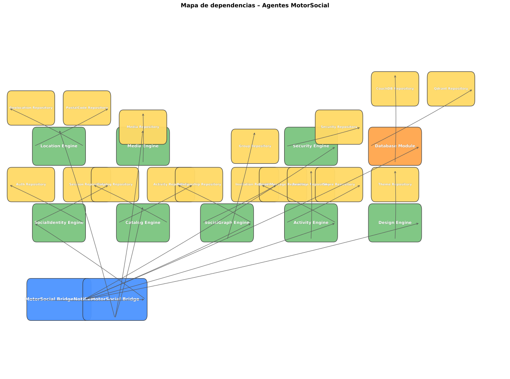

# Agent Guide – MotorSocial

Este documento describe la relación de agentes del motor social, sus capacidades, habilidades y esquema de autenticación vigente según el código fuente en `../motorsocial` y `../pruebamotorsocial`.

---

## Relación General

| #   | Nombre                      | Tipo          | Ubicación principal                                            |
| --- | --------------------------- | ------------- | -------------------------------------------------------------- |
| 1   | `MotorSocialBridge`         | Orquestador   | `pruebamotorsocial/lib/core/motorsocial_bridge/bridge.dart`    |
| 2   | `MotorSocialBridgeNotifier` | Estado global | `pruebamotorsocial/lib/core/motorsocial_bridge/bridge.dart`    |
| 3   | `SocialIdentityEngine`      | Dominio       | `motorsocial/lib/identity/social_identity_engine.dart`         |
| 4   | `CatalogEngine`             | Dominio       | `motorsocial/lib/catalog/engine/catalog_engine.dart`           |
| 5   | `SocialGraphEngine`         | Dominio       | `motorsocial/lib/social_graph/engine/social_graph_engine.dart` |
| 6   | `ActivityEngine`            | Dominio       | `motorsocial/lib/activity/engine/activity_engine.dart`         |
| 7   | `SecurityEngine`            | Dominio       | `motorsocial/lib/security/engine/security_engine.dart`         |
| 8   | `DesignEngine`              | Dominio       | `motorsocial/lib/design/engine/design_engine.dart`             |
| 9   | `LocationEngine`            | Dominio       | `motorsocial/lib/location/engine/location_engine.dart`         |
| 10  | `MediaEngine`               | Dominio       | `motorsocial/lib/media/engine/media_engine.dart`               |
| 11  | `DatabaseModule`            | Persistencia  | `motorsocial/lib/core/database/database_module.dart`           |

---

## 1. MotorSocialBridge

- **Nombre del Agente:** `MotorSocialBridge`
- **Tipo:** Orquestador
- **Capacidades:**
  - Integra todos los módulos funcionales del motor social: catálogo, identidad, diseño, actividad, base de datos y configuración.
  - Expone una instancia coherente y reconfigurable en runtime mediante `reinitialize`.
- **Habilidades (skills):**
  - Composición de engines y repositorios inyectables.
  - Reinitialización caliente sin reiniciar la app.
  - Proveedor Riverpod `motorSocialBridgeProvider` como punto de entrada global.
- **Autenticación:** No autentica por sí mismo; delega en `SocialIdentityEngine` y `AuthRepository`.

## 2. MotorSocialBridgeNotifier

- **Nombre del Agente:** `MotorSocialBridgeNotifier`
- **Tipo:** Estado global
- **Capacidades:**
  - Gestiona el ciclo de vida del `MotorSocialBridge` como estado global.
  - Permite reemplazar configuraciones y engines en caliente.
- **Habilidades (skills):**
  - `reinitialize` para cambiar `config`, `activityRepository` y `databaseModule`.
  - Integración directa con Riverpod.
- **Autenticación:** Hereda el estado de sesión activa administrado por el bridge.

## 3. SocialIdentityEngine

- **Nombre del Agente:** `SocialIdentityEngine`
- **Tipo:** Dominio
- **Capacidades:**
  - Motor de identidad genérico configurable por contrato JSON.
  - Gestión de login, registro, recuperación de contraseña, sesiones y roles.
- **Habilidades (skills):**
  - Validación de identificador por reglas (`identifierRules`).
  - UI parametrizada según `SocialIdentityContract`.
  - Role resolution automática con `RoleProfile`.
  - Resume de sesión previa.
- **Autenticación:**
  - Soporta tokens genéricos: `accessToken` y `refreshToken` en `AuthState`.
  - Demo sin backend real: `MemoryAuthRepository` retorna `AuthState.initial()`.

## 4. CatalogEngine

- **Nombre del Agente:** `CatalogEngine`
- **Tipo:** Dominio
- **Capacidades:**
  - CRUD y búsqueda de objetos sociales (`SocialObject`).
  - Paginación, ordenamiento y exportación configurable.
  - Indexación semántica con Qdrant.
- **Habilidades (skills):**
  - `CatalogQuery` para filtros configurables.
  - `DocumentExporter` con formatos declarativos.
  - Integración con `ActivityRepository` para trazabilidad.
- **Autenticación:** Acceso gobernado por `creatorId`; no define esquema propio.

## 5. SocialGraphEngine

- **Nombre del Agente:** `SocialGraphEngine`
- **Tipo:** Dominio
- **Capacidades:**
  - Administración de contactos, relaciones, grupos, membresías e invitaciones.
  - Estados evolutivos de relación: `pending`, `accepted`, `blocked`.
- **Habilidades (skills):**
  - Repos: `RelationshipRepository`, `InvitationRepository`, `GroupRepository`.
  - Límites configurables (ej. `maxMembersPerGroup`).
  - Proveedores Riverpod dedicados.
- **Autenticación:** Depende del contexto de usuario en `actorId`.

## 6. ActivityEngine

- **Nombre del Agente:** `ActivityEngine`
- **Tipo:** Dominio
- **Capacidades:**
  - Feed unificado, reacciones, mensajería directa, compartidos y notificaciones.
  - Modelo polimórfico por `verb` y TTL configurable.
- **Habilidades (skills):**
  - Verbs soportados: `view`, `like`, `share`, `message`, `comment`, `price_change`.
  - `ActivityQuery` parametrizable.
  - Inicialización de `feedProvider`, `conversationProvider`, `reactionProvider`.
- **Autenticación:** Vinculada al `actorId` en sesión.

## 7. SecurityEngine

- **Nombre del Agente:** `SecurityEngine`
- **Tipo:** Dominio
- **Capacidades:**
  - Auditoría, detección de anomalías, tracking de dispositivo y rate limiting.
  - Emisión estructurada de eventos de seguridad.
- **Habilidades (skills):**
  - Hooks `onLogin` y `onSuspiciousActivity`.
  - Detección automática de dispositivo.
  - Persistencia via `SecurityRepository`.
- **Autenticación:** No realiza login; registra eventos vinculados a `userId`.

## 8. DesignEngine

- **Nombre del Agente:** `DesignEngine`
- **Tipo:** Dominio
- **Capacidades:**
  - Motor parametrizado de temas y tokens visuales.
  - Carga, listado y guardado de temas.
- **Habilidades (skills):**
  - `DesignTokenSet` configurable por categorías y modos.
  - Integración con `ThemeRepository`.
- **Autenticación:** Sin esquema propio; protección por sesión externa en app cliente.

## 9. LocationEngine

- **Nombre del Agente:** `LocationEngine`
- **Tipo:** Dominio
- **Capacidades:**
  - Geolocalización, lookup de códigos postales y selección manual de ubicación.
- **Habilidades (skills):**
  - GPS, mapa y búsqueda textual por colonia o CP.
  - Proveedor configurable (ej. Google Maps).
- **Autenticación:** Sin auth propia; usa contexto de usuario en `LocationContract`.

## 10. MediaEngine

- **Nombre del Agente:** `MediaEngine`
- **Tipo:** Dominio
- **Capacidades:**
  - Biblioteca multimedia, selector de assets, slideshow y álbumes ordenables.
- **Habilidades (skills):**
  - Límites: `maxFileSizeMb`, `maxDimension`, `maxAssetsPerOwner`.
  - Formatos: imágenes `jpg/jpeg/png/webp` y videos `mp4/mov/webm`.
  - Orden y portada configurables.
- **Autenticación:** Vinculada a propietario del asset; no maneja credenciales.

## 11. DatabaseModule

- **Nombre del Agente:** `DatabaseModule`
- **Tipo:** Persistencia
- **Capacidades:**
  - Capa de persistencia adaptable: CouchDB remota, Qdrant vectorial o memoria.
  - Cambio total de backend sin reescribir módulos superiores.
- **Habilidades (skills):**
  - Modo `inMemory()` para demo y `fromConfig` para producción.
  - Diseños de CouchDB incluidos.
  - Colecciones vectoriales con índices payload.
- **Autenticación:**
  - En demo no requiere credenciales.
  - En producción almacenaría credenciales de CouchDB/Qdrant.

---

## Esquema de Autenticación Consolidado

| Mecanismo               | Entidad                                               | Estado                    |
| ----------------------- | ----------------------------------------------------- | ------------------------- |
| Sesión genérica         | `AuthState.userId`                                    | Demo o producción         |
| Token de acceso         | `AuthState.accessToken`                               | JWT / token genérico      |
| Refresh token           | `AuthState.refreshToken`                              | Renovación de sesión      |
| Rol activo              | `AuthState.role`                                      | `RoleProfile`             |
| Lista de roles          | `AuthState.availableRoles`                            | Multirol                  |
| Reglas de identificador | `SocialIdentityContract.identifierRules`              | Regex/longitud            |
| Eventos de seguridad    | `SecurityEvent`                                       | Auditoría                 |
| Rate limiting           | `SecurityContract`                                    | Configurable por contrato |
| Rol por defecto         | `motorsocial_contracts.json -> identity.defaultRoles` | Actualmente `"user"`      |

---

## Colecciones Vectoriales (Qdrant)

| Colección                | Propósito                     | Dimensiones |
| ------------------------ | ----------------------------- | ----------- |
| `motorsocial_users`      | Perfil semántico de usuarios  | 384         |
| `motorsocial_objects`    | Objetos sociales indexables   | 384         |
| `motorsocial_activities` | Eventos y actividad semántica | 384         |

---

## Próximos pasos sugeridos

- Formalizar fichas de usuario en formato JSON Schema.
- Definir skill registry explícito por agente y exponerlo por endpoint.
- Mapear `SecurityEvent` y `AuthState` a un protocolo de autenticación real.
- Agregar binding semántico `QdrantAdapter` detrás de `DatabaseModule` en producción.

---

## Mapa de dependencias entre agentes



### Convenciones del grafo

- **Nodo azul:** orquestador/estado global.
- **Nodo verde:** módulos de dominio.
- **Nodo naranja:** persistencia.
- **Nodo amarillo:** repositorios concretos.

### Regenerar el diagrama

```bash
cd ../pruebamotorsocial
python3 docs/update_agent_graph.py
# o, alternativa Dart:
# dart docs/update_agent_docs.dart
```

> Nota: el script Dart también valida/reescribe `docs/AGENT_GUIDE.json`.

Esta versión del documento incluye:

1. Fichas Markdown detalladas.
2. Archivo JSON estructurado con todos los agentes.
3. Diagrama de dependencias en `../pruebamotorsocial/docs/agent_dependency_graph.svg`.
